[](https://github.com/fom-big-data-bike-path-quality/fom-big-data-bike-path-quality-android/actions/workflows/build-app-workflow.yml)
[](https://github.com/fom-big-data-bike-path-quality/fom-big-data-bike-path-quality-android/issues)

<br />
<p align="center">
  <a href="https://github.com/fom-big-data-bike-path-quality/fom-big-data-bike-path-quality-android">
    
  </a>

  <h1 align="center">Bike Path Quality (Ahuacamolli)</h1>

  <p align="center">
    Android application that lets you track raw data for <a href="https://github.com/fom-big-data-bike-path-quality/fom-big-data-bike-path-quality-model">bike path quality analysis</a> 
  </p>
</p>

## About The Project

The aim of this app is to track phone sensor data while riding a bike. These sensor data include
* [geolocation](https://developer.android.com/training/location) including speed
* [accelerometer](https://developer.android.com/guide/topics/sensors/sensors_motion)

After you performed a bike activity (aka bike trip) you can review the bike activity and the tracked samples, specify the surface type and smoothness type of the bike path and upload the data.
The uploaded raw data will be used to train [a neural net](https://github.com/fom-big-data-bike-path-quality/fom-big-data-bike-path-quality-model) which will be able to determine the surface type of a bike path as well as to detect anomalies such as potholes based on sensor data.

### Built With

* [Firebase Cloud Firestore](https://firebase.google.com/)
* [Mapbox](https://www.mapbox.com/)

## Installation

The app will only work with Android devices with [Android 8.0 (API level 26)](https://developer.android.com/studio/releases/platforms#8.0) or above.
On your Android device [opt-in for installing unknown apps](https://developer.android.com/distribute/marketing-tools/alternative-distribution#unknown-sources).
There are two ways to install the app - from the bundled releases and from your local IDE.

### Install bundled release (recommended)

* Download the latest ```app-release.apk``` from the [releases section](https://github.com/fom-big-data-bike-path-quality/fom-big-data-bike-path-quality-android/releases)
* Open the file and follow the instructions

### Install from local IDE

* Download and install the latest version of [Android Studio](https://developer.android.com/studio)
* Clone the repo
 ```sh
 git clone git@github.com:fom-big-data-bike-path-quality/fom-big-data-bike-path-quality-android.git
 ```
* Open the project in Android Studio

* Setup Firebase for Android as described [here](https://firebase.google.com/docs/android/setup)
* Setup Mapbox Maps SDK as described [here](https://docs.mapbox.com/android/maps/guides/install/)
* Setup app signing as described [here](https://developer.android.com/studio/publish/app-signing)

* Connect an Android device via USB cable
* Run the app

## Usage

On first start-up of the app you will be prompted to give permission to track location and activity transition (this is used for _automatic tracking mode_). Click _CONTINUE_ in both cases and allow both _while using the app_. After that you will see the main screen. 
From the main screen other screens like the _sensors screen_ and the _log screen_ can be reached by swiping left or right. The _settings screen_ is displayed after clicking the settings icon in the menu.

  |    |  
:-------------------------:|:-------------------------:|:-------------------------:
Permission rationale location | Permission rationale activity transition | Main screen

Both sensors screen and log screen can help you understand measured values and actions performed by the app.
On the sensors screen currently measured values are displayed. The log screen displays logging information about the app status. In the settings screen you can define preferred phone position and bike type. Furthermore you can decide whether tracking shall be started and stopped automatically. Also measurement intervals and sample sizes can be specified.
The app can track biking data in two modes
* **automatic tracking** <sup>experimental</sup> will automatically start and stop bike activity tracking when you start or stop riding a bike
* **manual tracking** allows you to start and stop a bike activity whenever you want

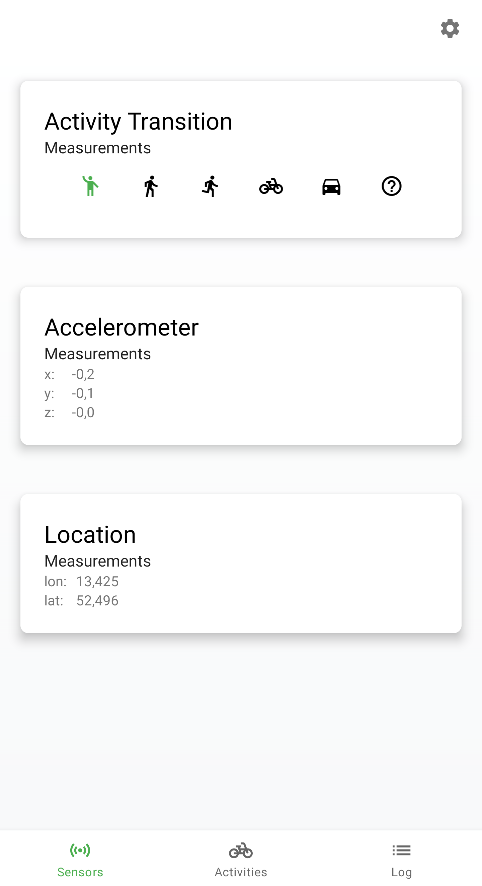  |  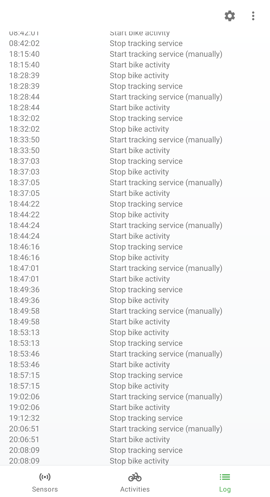  |  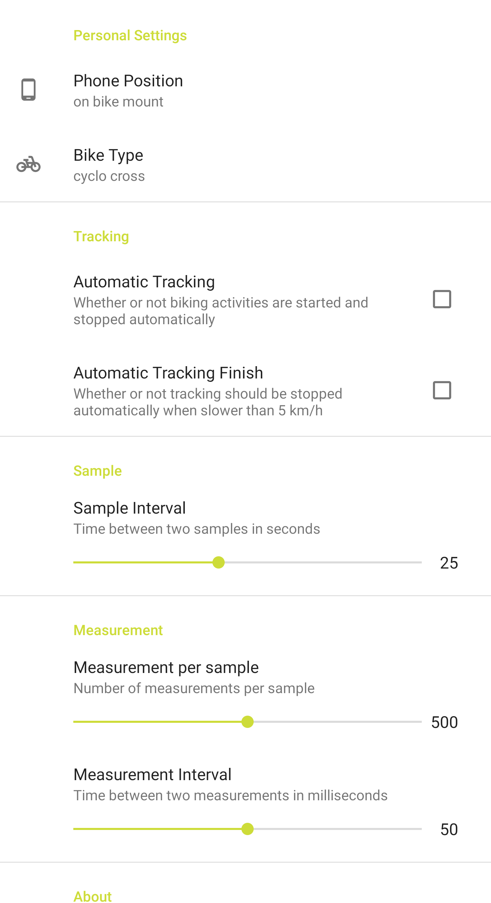
:-------------------------:|:-------------------------:|:-------------------------:
Sensors screen | Log screen | Settings screen

On the main screen you can can start manual tracking by clicking the green arrow button. 

> **Important:** in order to train the model pure data is needed. Try to ride on one surface type only when tracking a bike activity. Stop and restart the activity tracking when you switch the surface type. (Later you can set the surface type for each sample individually which might become cumbersome if you need to do it for too many samples)

In order to ensure a safe right without distractions you can switch to head-up mode by clicking on the square icon in the menu.
In head-up mode your current speed, the current bumpiness of the surface and the collected samples are displayed. 
The color of the screen indicates how bumpy the surface currently is.
You can return from head-up mode and start or stop tracking by using the buttons on the bottom.

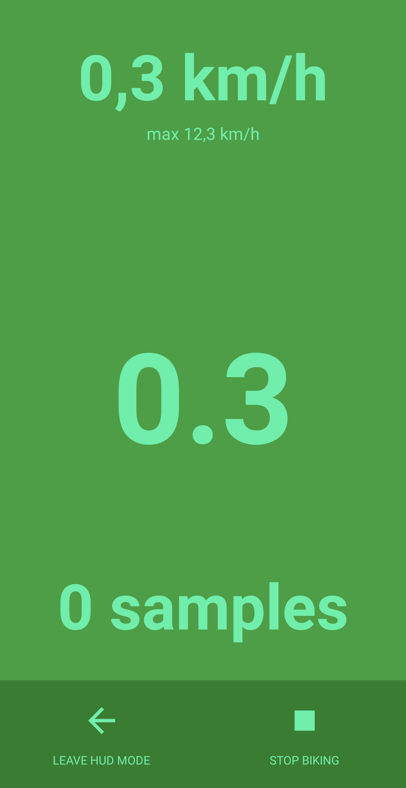  |  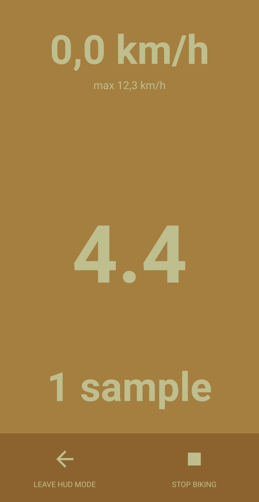  |  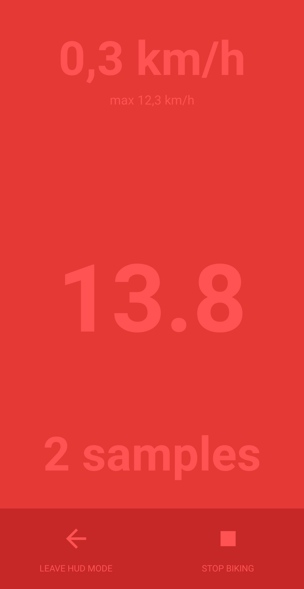
:-------------------------:|:-------------------------:|:-------------------------:
HUD screen with smooth surface | HUD screen with intermediate surface | HUD screen with rough surface

Once you completed the tracking of a bike activity you can see the details by clicking on its list entry on the main screen. From here you can specify the surface type and the smoothness type of the bike activity. Phone position and bike type are prefilled with the values you specified in the settings screen. 

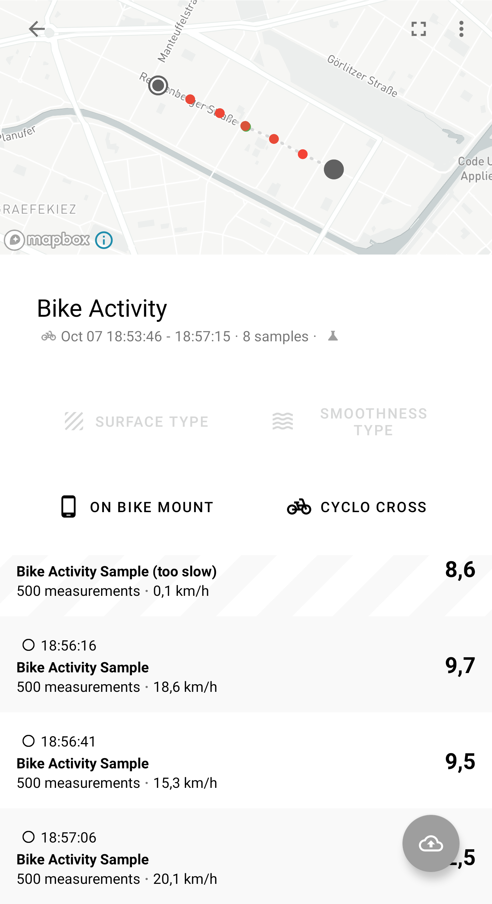  |  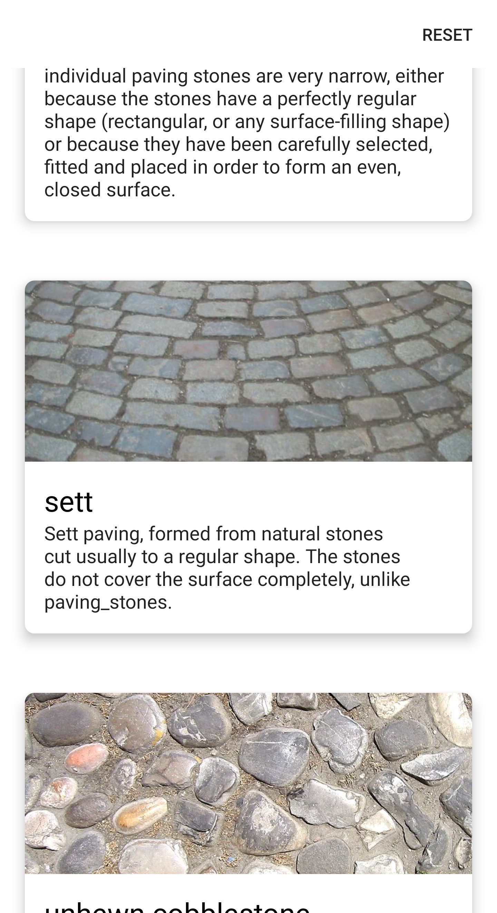  |  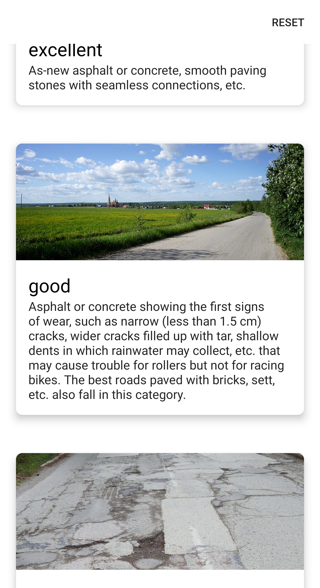
:-------------------------:|:-------------------------:|:-------------------------:
Activity details | Surface type selection | Smoothness type selection

The surface type for the bike activity you can overridden for single parts. You can do so by selecting a sample from the list and click the dashed button next to it.
After setting all fields you can upload your tracking results by hitting the green floating action button.

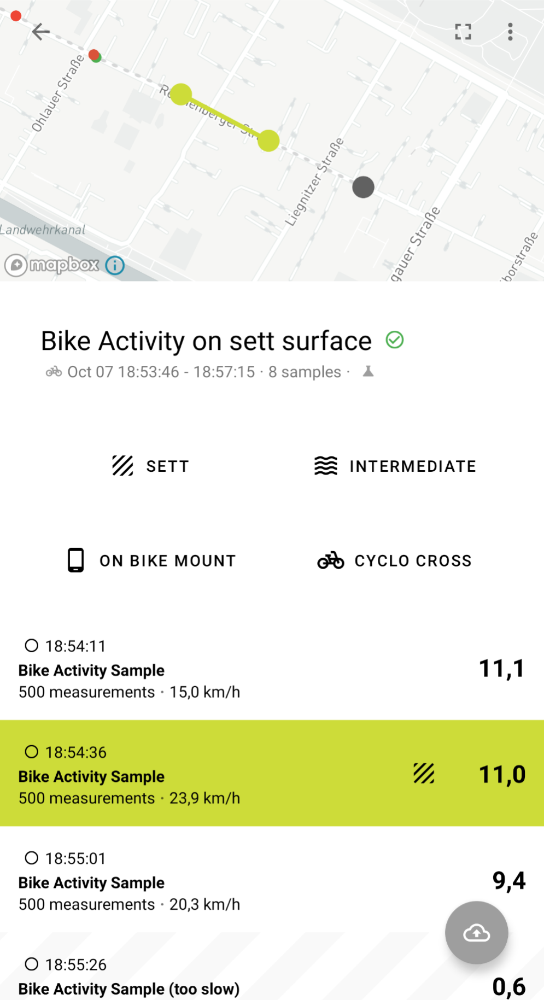 | 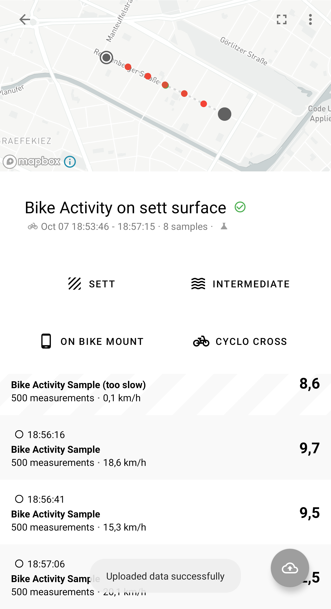
:-------------------------:|:-------------------------:
Activity details with focus | Activity upload

## Roadmap

See the [open issues](https://github.com/fom-big-data-bike-path-quality/fom-big-data-bike-path-quality-android/issues) for a list of proposed features (and known issues).

### Version 1.*

* 1.13.0 Material You support
* 1.12.0 Phone position and bike type preferences
* 1.11.0 Head-up mode
* 1.10.0 Bike activity sample span highlight
* 1.9.0 Bike activity sample color code
* 1.8.0 Invalid bike activity sample indicator
* 1.7.0 Under-lab-conditions flag
* 1.6.0 Tracking fixes
* 1.5.0 Firebase upload
* 1.4.0 Phone position and bike type selection
* 1.3.0 Configurable tracking intervals
* 1.2.0 Activity sample selection
* 1.1.0 Anonymous user identification
* 1.0.0 Basic functionality
  * Activity transition detection
  * Accelerometer sensor measurement
  * Location sensor measurement
  * Bike activity tracking - in background, manual and automatic
  * Bike activity samples on a map
  * Surface type and smoothness type selection

### Version 2.*

* app version for the broad public that does not require manual input

## Contributing

Since this project is part of an ongoing Master's thesis contributions are not possible as for now.

## License

Distributed under the GPLv3 License. See [LICENSE.md](./LICENSE.md) for more information.

## Contact

Florian Schwanz - florian.schwanz@gmail.com

## Acknowledgements

Icon made by Freepik from www.flaticon.com
