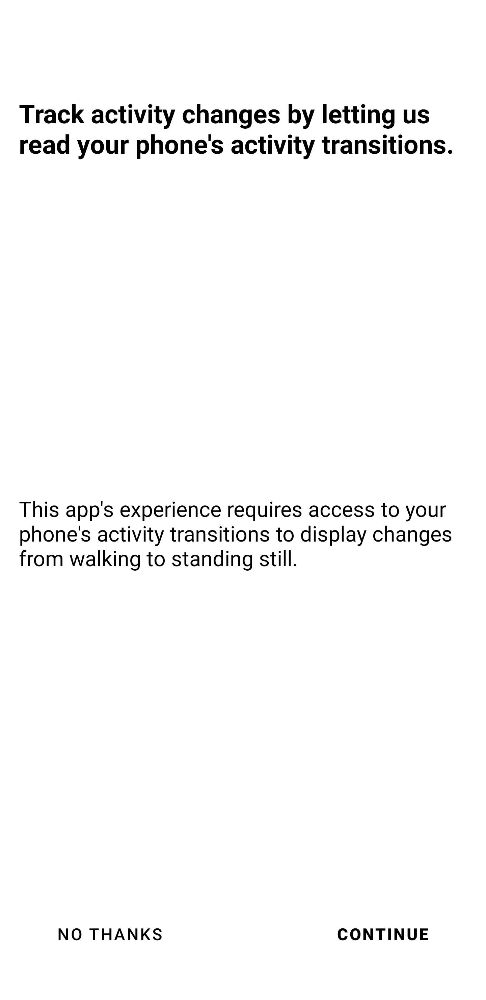
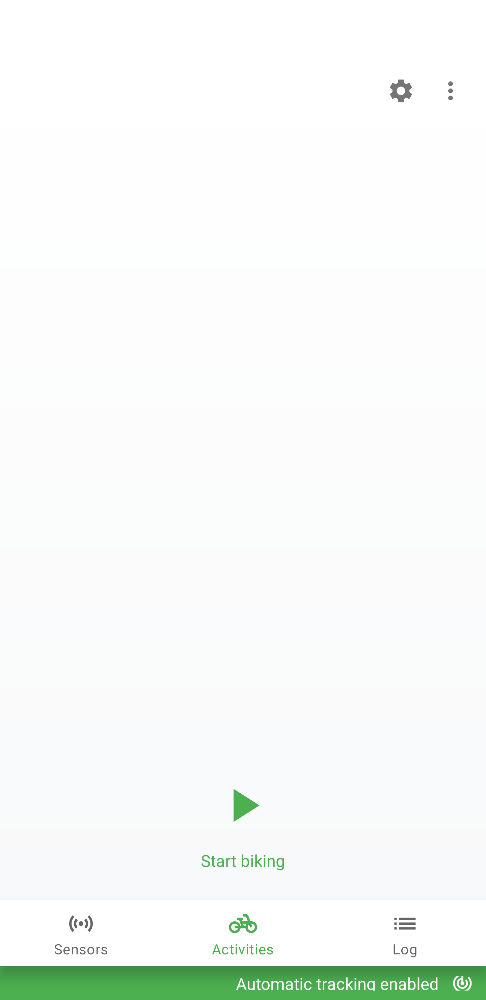
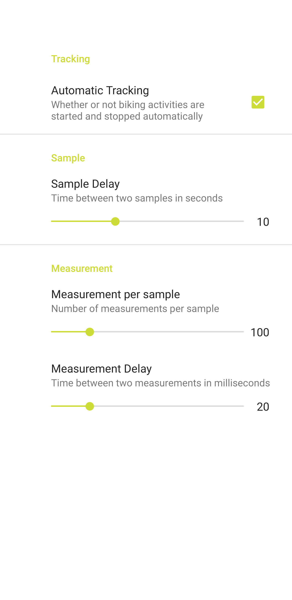
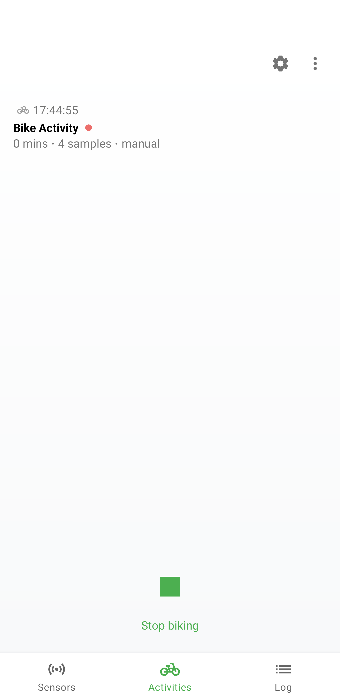
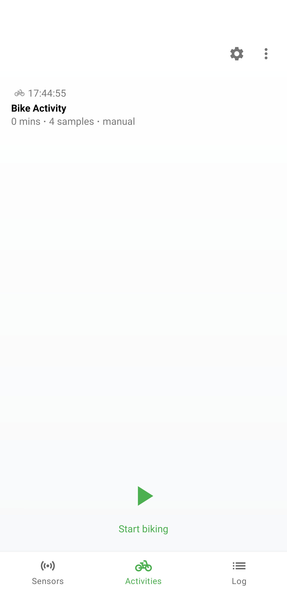
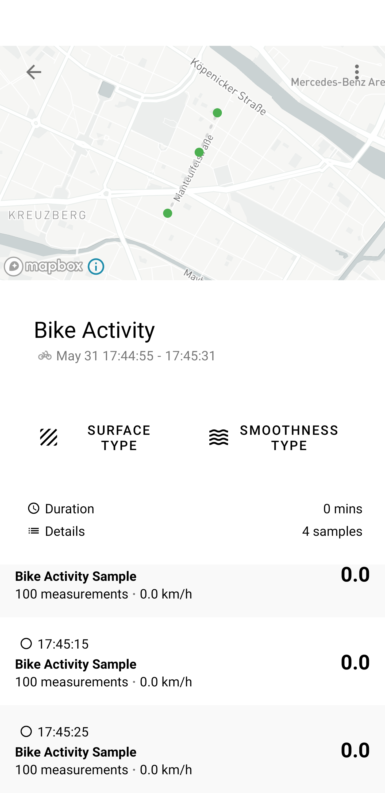
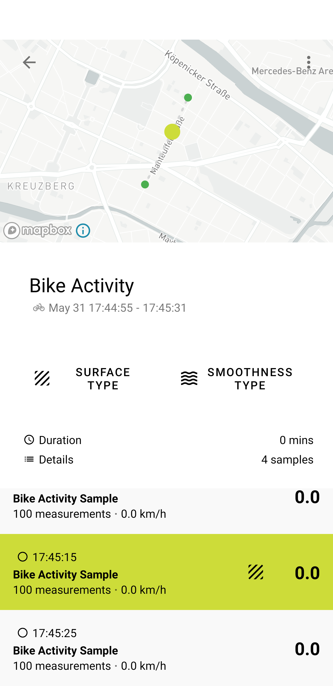
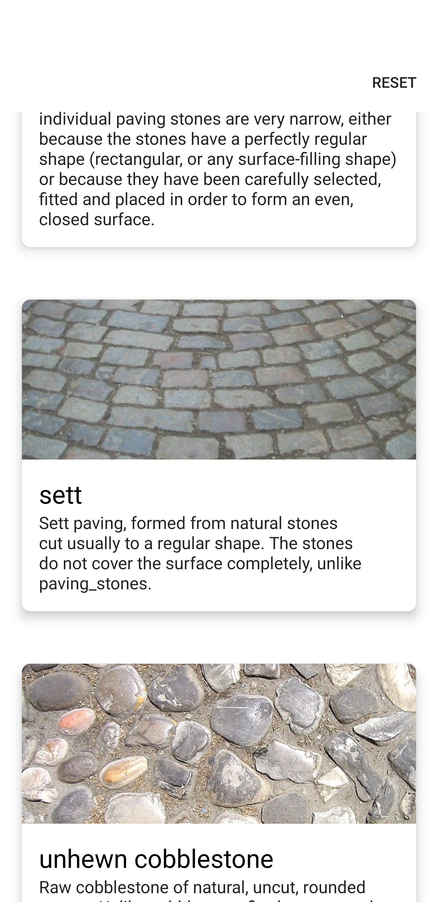
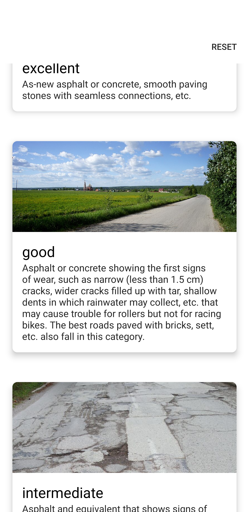
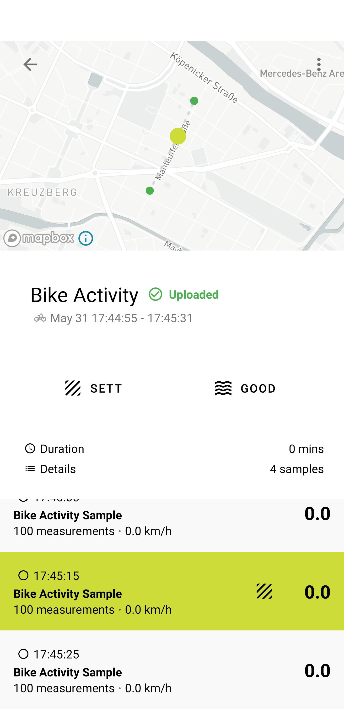

[](https://github.com/florianschwanz/fom-big-data-bike-path-quality-android/actions/workflows/build-app-workflow.yml)
[](https://github.com/florianschwanz/fom-big-data-bike-path-quality-android/issues)

<br />
<p align="center">
  <a href="https://github.com/florianschwanz/fom-big-data-bike-path-quality-android">
    
  </a>

  <h1 align="center">Bike Path Quality (Ahuacamolli)</h1>

  <p align="center">
    Android application that let's you track raw data for bike path quality analysis 
  </p>
</p>

## About The Project

The aim of this app is to track phone sensor data while riding a bike. These sensor data include
* [geolocation](https://developer.android.com/training/location) including speed
* [accelerometer](https://developer.android.com/guide/topics/sensors/sensors_motion)

After you performed a bike activity (aka bike trip) you can review the bike activity and the tracked samples, specify the surface type and smoothness type of the bike path and upload the data.
The uploaded raw data will be used to train [a neural net](https://github.com/florianschwanz/fom-big-data-bike-path-quality-model) which will be able to determine the surface type of a bike path as well as to detect anomalies such as potholes based on sensor data.

### Built With

* [Firebase Cloud Firestore](https://firebase.google.com/)
* [Mapbox](https://www.mapbox.com/)

## Installation

The app will only work with Android devices with [Android 8.0 (API level 26)](https://developer.android.com/studio/releases/platforms#8.0) or above.
On your Android device [opt-in for installing unknown apps](https://developer.android.com/distribute/marketing-tools/alternative-distribution#unknown-sources).
There are two ways to install the app - from the bundled releases and from your local IDE.

### Install bundled release (recommended)

* Download the latest ```app-release.apk``` from the [releases section](https://github.com/florianschwanz/fom-big-data-bike-path-quality-android/releases)
* Open the file and follow the instructions

### Install from local IDE

* Download and install the latest version of [Android Studio](https://developer.android.com/studio)
* Clone the repo
 ```sh
 git clone git@github.com:florianschwanz/fom-big-data-bike-path-quality-android.git
 ```
* Open the project in Android Studio
* Connect an Android device via USB cable
* Run the app

## Usage

On first start-up of the app you will be prompted to give permission to track location and activity transition (this is used for _automatic tracking mode_). Click _CONTINUE_ in both cases and allow both _while using the app_. After that you will see the main screen.

  |    |  
:-------------------------:|:-------------------------:|:-------------------------:
Permission rationale location | Permission rationale activity transition | Main screen

The app can track biking data in two modes
* **automatic tracking** <sup>experimental</sup> will automatically start and stop bike activity tracking when you start or stop riding a bike 
* **manual tracking** allows you to start and stop a bike activity whenever you want (this will disable automatic tracking)
You can switch between the two modes in the settings menu which you can reach by clicking on the gear symbol in the top right corner.

Start a bike activity (either automatically by starting to ride a bike if you used automatic tracking or manually by clicking the play button) which will add an entry for the ongoing tracking to the activity list.
**Important:** in order to train the model pure data is needed. Try to ride on one surface type only when tracking a bike activity. Stop and restart the activity tracking when you switch the surface type. (Later you can set the surface type for each sample individually which might become cumbersome if you need to do it for too many samples) 

Stop the bike activity (either by stopping to ride your bike if you used automatic tracking and/or by clicking the stop button)

  |    |  
:-------------------------:|:-------------------------:|:-------------------------:
Settings screen | Ongoing activity tracking | Completed activity tracking

Click on an activity in the list to get to the activity details screen in which you can see your bike activity on a map and a list of tracked samples.
Click on any sample in the list to highlight it on the map. Next to a highlighted sample the _surface type_ icon appears which lets you set the surface type for an individual sample.

  |  
:-------------------------:|:-------------------------:
Activity details screen | Highlighted activity sample

Click on _Surface type_ to select the surface you did the ride on.
Click on _Smoothness type_ to evaluate the quality of the bike path surface.
After both surface type and smoothness type are selected click on the floating action button in the bottom right corner in order to upload you activity data. An _Uploaded_ badge will appear next to the title indicating that the upload was successful. The data includes a user ID that identifies you anonymously.

  |    |  
:-------------------------:|:-------------------------:|:-------------------------:
Surface type selection | Smoothness type selection | Uploaded activity

## Roadmap

See the [open issues](https://github.com/florianschwanz/fom-big-data-bike-path-quality-android/issues) for a list of proposed features (and known issues).

### Version 1.*

* 1.3.0 Configurable tracking intervals
* 1.2.0 Activity sample selection
* 1.1.0 Anonymous user identification
* 1.0.0 Basic functionality

### Version 2.*

* app version for the broad public that does not require manual input

## Contributing

Since this project is part of an ongoing Master's thesis contributions are not possible as for now.

## License

Distributed under the GPLv3 License. See [LICENSE.md](./LICENSE.md) for more information.

## Contact

Florian Schwanz - florian.schwanz@gmail.com

## Acknowledgements

Icon made by Freepik from www.flaticon.com